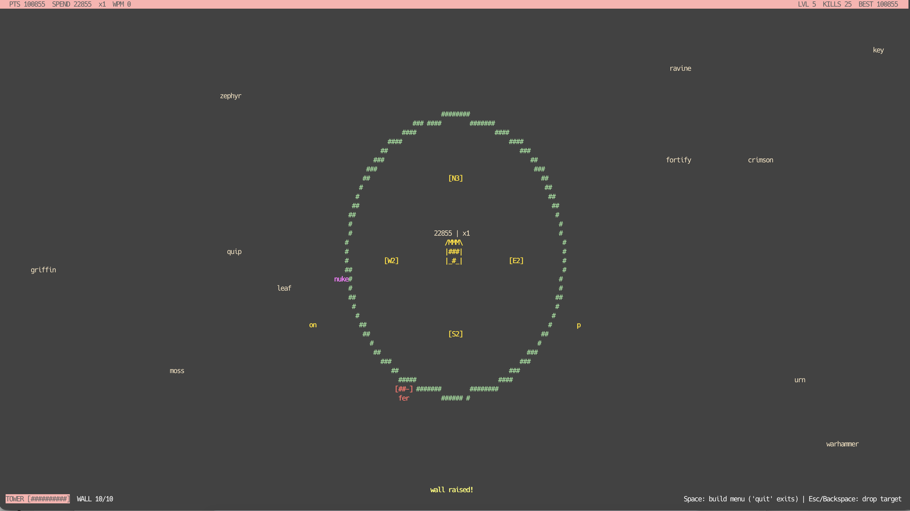
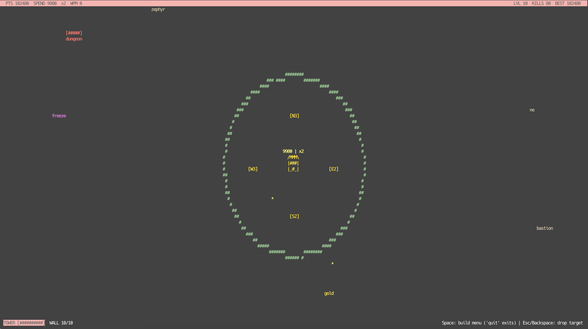

# keyboardTD

A typing tower defense that runs in your terminal — or your browser. A tower
sits in the middle of the screen; enemies walk in from the edges, each
carrying a word. Type the word to kill the enemy before it reaches the
tower. Everything — fighting, shopping, even quitting — is done by typing.



## Play it now

- **Browser** (nothing to install): **<https://td.zboina.pl>** — runs
  client-side, zero input latency, and your best runs can enter the online
  hall of fame.
- **Terminal**: grab a binary from the
  [releases page](https://github.com/zboinek/keyboardTD/releases) — Linux
  x64, macOS arm64, and a standalone Windows `.exe`.
- **From source**: see [Building](#building-it-yourself) below.

## How to play

Type the **first letter** of an enemy's word to target it (the closest
matching enemy is picked); its word turns yellow. Keep typing — the last
letter kills it. A typo flashes the screen red and resets your combo, but
not your typing progress.

| Key | Effect |
| --- | ------ |
| `a`–`z` | fight (and navigate every menu) |
| `Space` | open the build menu |
| `1` `2` `3` | pick a level-up upgrade |
| `Esc` / `Backspace` | drop the current target |
| `Enter` | start / play again |

An enemy's strength is its letter count, and the pressure ramps up over
time: more enemies, faster, with longer words. You won't out-type the
late game — you're buying time to build the machine that fights with you.

### Power-ups (magenta words)

A power-up walks in from the border every ~15–30 seconds. Type its word
before it reaches the tower (a wasted one just despawns):

- `freeze` — enemies and spawning stop for 5 seconds.
- `nuke` — cuts the last 2 letters off every enemy's word; anything left
  with nothing to type dies.
- `earthquake` — instantly crushes 1–5 enemies, nearest to the tower
  first. A struck boss loses its current word instead of dying.
- `heal` — restores 3 tower HP (only offered when you're damaged).

### Bosses (red, with a health bar)

Every ~30–45 seconds a slow boss spawns carrying **several words in a row**
(up to 5). The `[###--]` bar above it shows words remaining. Finish them
all for a fat bounty (times your combo). A boss that reaches the tower
hits for **3 damage**.

### Building (shopping is typing too)

Press `Space` — the game keeps running underneath, so pick your moment.
The menu is predictive: options appear grayed out with prices, letters
filter them as you type, and each word commits the moment it's complete.
`Space` then `buildtowernorth` flows as one typed sequence.

| Menu path | Base cost | Effect |
| --------- | --------- | ------ |
| `build > wall` | 10000 | Ring with 10 HP; absorbs enemies that touch it (bosses cost it 3). |
| `repair > wall` | 2500 | Restore the wall to full. |
| `build > tower > north/…` | 8000 | Auto-turret; strips untyped letters off the nearest enemy. |
| `upgrade > tower > direction` | 6000 × level | More letters per shot, faster fire (max L4). |

Turrets pay you 5 points per letter stripped, keep firing during a
`freeze`, and the enemy a turret is working on glows **cyan** — so you
know it's handled and can type something else.



### Level-up drafts

Every 2nd level the game **fully pauses** and deals 3 of 12 upgrades —
press `1`, `2`, or `3`. Longer freezes, a bigger nuke, a stronger
earthquake, more tower HP, a gun for the tower itself, combo perks,
cheaper walls, richer turrets, and more. ~10 drafts per good run and 30
tiers total, so every run builds different.

### Scoring & the hall of fame

- Kill = `word length × 10 × combo`.
- Combo grows every 5 flawless kills; a typo or a leaked enemy resets it.
- The HUD splits **PTS** (everything you've earned — your record) from
  **SPEND** (what's in your pocket): spending never hurts your high score.
- On the web version, a top-10 run lets you type a nick onto the shared
  **hall of fame** (best 10 runs, shown on the welcome screen).

---

## Boring technical stuff

### Building it yourself

Terminal build (needs a C++17 compiler and ncurses, both stock on
macOS/Linux):

```sh
make run
```

`./keyboardtd --cheat` starts with a 100k-point cushion for testing and
screenshots; cheat runs never touch the high score or the hall of fame.

### Browser version

The same `game.cpp` compiles to WebAssembly and renders ANSI frames into
an xterm.js terminal. The easiest build is Docker (compiles inside the
Emscripten image, serves with nginx):

```sh
docker build -t keyboardtd .
docker run --rm -p 8080:80 -v "$PWD/data:/data" keyboardtd
# open http://localhost:8080
```

With the Emscripten SDK installed locally, `make web` builds the static
site into `dist/web/` instead.

### Hall-of-fame API

The web image bundles a tiny same-origin API (nginx proxies `/api/` to a
stdlib-only Python sidecar; SQLite at `/data/scores.db` — mount a volume
or scores vanish on redeploy):

- `GET /api/top10` — the 10 best runs
- `POST /api/score` — `{nick, score, wpm, level, duration}`

Scores are client-reported, so validation only blocks lazy forgeries:
nick `[a-z0-9]{3,10}`, sane wpm/duration bounds, score plausibility versus
run length, and per-IP rate limits.

### Releases & CI

Pushing a version tag triggers two GitHub Actions workflows:

- **docker** — builds the web image and pushes it to GHCR as
  `ghcr.io/<owner>/<repo>:<tag>` and `:latest` (amd64 + arm64).
- **release** — builds the terminal game for Linux x64, macOS arm64, and
  Windows x64 (PDCursesMod, so the `.exe` runs standalone) and attaches
  the binaries to a GitHub Release.

### Code layout

```
src/game.h               shared interface: Screen cell grid + game API
src/game.cpp             all game logic and drawing (frontend-free)
src/platform_ncurses.cpp terminal frontend
src/platform_web.cpp     browser frontend (ANSI frames into xterm.js)
web/index.html           page shell for the browser build
server/                  hall-of-fame API + nginx config for the web image
```
